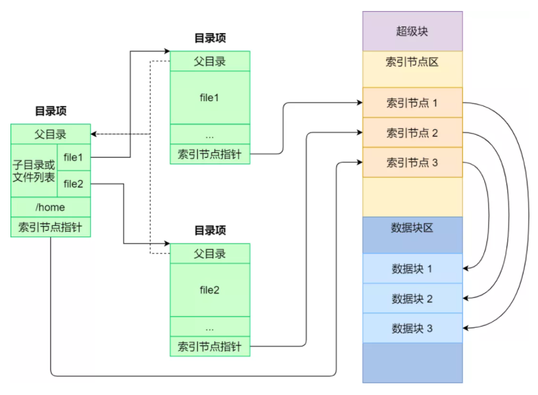
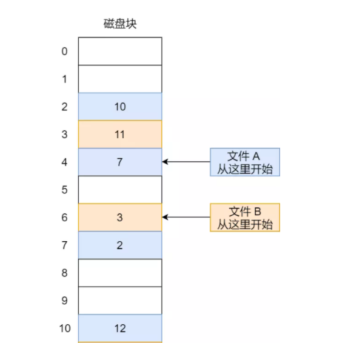
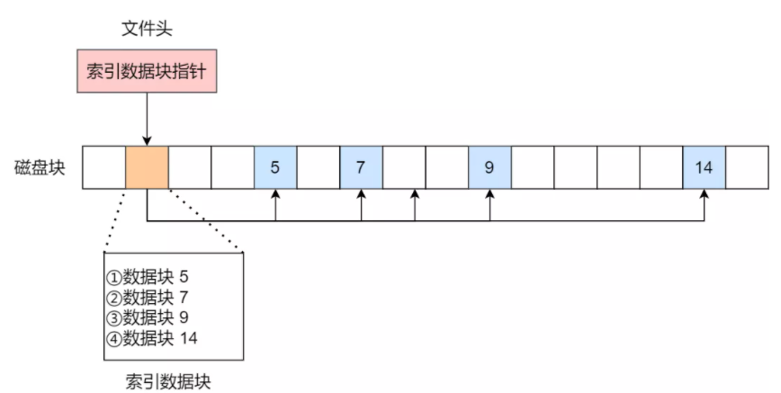

### 文件系统结构

* 超级块：存储文件系统的详细信息，比如块个数、块大小、空闲块等等。在文件系统挂载时进入内存。

* 目录项：*dentry*，用来记录文件的名字、索引节点指针以及与其他目录项的层级关联关系。多个目录项关联起来，就会形成目录结构，但它与索引节点不同的是，目录项是由内核维护的一个数据结构，不存放于磁盘，而是缓存在内存。

* 索引节点：*inode*，用来记录文件的元信息，比如 inode 编号、文件大小、访问权限、创建时间、修改时间、数据在磁盘的位置等等。索引节点是文件的唯一标识，通常会被存储在硬盘中，但在文件被访问时会被载入内存中。

* 数据块：文件系统操作的基本单位，磁盘读写的最小单位是扇区，扇区的大小只有 `512B` ，如果每次读写都以扇区为单位，那么读写的效率会非常低。所以，文件系统把多个扇区组成一个数据块来提高磁盘的读写效率。Linux 中的数据块大小为 `4KB`，也就是一次性读写 8 个扇区。

### 文件存储

#### 连续存储

文件存放在磁盘连续的物理空间中。因为文件的数据都是紧密相连，一次磁盘寻道就可以读出整个文件，所以读写效率很高。

但缺点是容易产生磁盘碎片，并且文件长度不易扩张。

#### 非连续存储

##### 链表

链表的方式存放是离散的，不连续的，可以消除磁盘碎片，大大提高磁盘空间的利用率，同时文件的长度可以动态扩展。

根据实现的方式的不同，链表可分为隐式链表和显式链接两种形式。

###### 隐式链表

文件头要包含一个头结点和一个尾结点 (即第一个数据块和最后一个数据块的位置)，并且每个数据块里面留出一个指针空间，用来存放下一个数据块的位置。

缺点是无法直接访问数据块，只能通过指针顺序访问文件，以及数据块指针消耗了一定的存储空间。隐式链接分配的稳定性较差，系统在运行过程中由于软件或者硬件错误导致链表中的指针丢失或损坏，会导致文件数据的丢失。

###### 显示链表

把用于链接文件各数据块的指针，显式地存放在内存的一张链接表中，该表在整个磁盘仅设置一张，每个表项中存放链接指针，指向下一个数据块号。这个表格称为文件分配表 (File Allocation Table，FAT)。

##### 索引

索引的实现是为每个文件创建一个索引数据块，里面存放的是指向文件数据块的指针列表。另外，文件头需要包含指向索引数据块的指针，这样就可以通过文件头知道索引数据块的位置，再通过索引数据块里的索引信息找到对应的数据块。

缺点是索引会占用一部分物理空间。

创建文件时，索引块的所有指针都设为空。当首次写入第 i 块时，先从空闲空间中取得一个块，再将其地址写到索引块的第 i 个条目。

#### 目录存储

普通文件的块里面保存的是文件数据，而目录文件的块里面保存的是一项一项的文件信息。

目录一般使用列表保存数据，列表中每一项就代表该目录下的文件的文件名和对应的 inode，通过这个 inode，就可以找到真正的文件。

通常，第一项是`.`，表示当前目录，第二项是`..`，表示上一级目录，接下来就是一项一项的文件名和 inode。

为了提高查找效率，一般使用哈希表存储。key 为文件名的 hash 值，value 为对应的 inode。

### 空闲空间管理

#### 空闲表法

空闲表法就是为所有空闲空间建立一张表，表内容包括空闲区的第一个块号和该空闲区的块个数。这种方式采用连续存储策略。

#### 位图法

位图是利用二进制的一位来表示磁盘中一个盘块的使用情况，磁盘上所有的盘块都有一个二进制位与之对应。当值为 0 时，表示对应的盘块空闲，值为 1 时，表示对应的盘块已分配。

#### 软链接和硬链接

* 硬链接是多个目录项中的索引节点指针指向一个文件，只有删除文件的所有硬链接以及源文件时，系统才会彻底删除该文件。

* 软链接相当于重新创建一个文件，这个文件有独立的 inode，但是这个文件的内容是另外一个文件的路径，所以访问软链接的时候，实际上相当于访问到了另外一个文件。如果目标文件被删除了，链接文件还是在的，只不过指向的文件找不到了而已。

### 文件 I/O

#### 阻塞 I/O

当用户程序执行 `read` ，线程会被阻塞，一直等到内核数据准备好，并把数据从内核缓冲区拷贝到用户缓冲区中，当拷贝过程完成，`read` 才会返回。

#### 非阻塞 I/O

当用户执行 `read` 请求时，如果数据没有准备好，立即返回可以做其他事情。但应用程序需要不断轮询内核，直到数据准备好，内核将数据拷贝到应用程序缓冲区，`read` 调用才会返回。

#### I/O 多路复用

使用一个进程监视多个文件描述符，一旦某个文件描述符就绪，能够通知程序进行相应的读写操作。

目前支持 IO 多路复用的系统有 select、poll、epoll，但它们本质上都是同步 IO  (数据拷贝过程阻塞)。

> 文件描述符 (file descriptor，简称 fd) 在形式上是一个非负整数，用于指代被打开的文件。程序刚刚启动的时候，0 是标准输入，1 是标准输出，2 是标准错误。如果此时去打开一个新的文件，它的文件描述符会是 3。实际上，它是一个索引值，每个进程会维护一个打开文件的记录表，这个记录表分为两部分，一部分是文件描述符，一部分是文件指针，指向文件位置。

##### select

当用户进程调用 select 的时候，select 会将需要监控的文件描述符的集合拷贝到内核空间中，然后遍历集合检查是否有可读/可写事件，如果存在就通知程序读写数据，如果不存在，就会进入睡眠状态，直到等待时间超时，继续重复这个过程。

select 需要自己不断轮询所有的文件描述符的集合，直到设备就绪，期间可能要睡眠和唤醒多次交替。

缺点是 select 支持的文件描述符数量只有 1024 个，并且每次调用 select 都需要把文件描述符的集合从用户空间拷贝到内核空间，而且每次都需要遍历所有的文件描述符，这个开销在文件描述符很多时会很大。

##### poll

poll 本质上和 select 没有区别，只是描述文件描述符集合的方式不同，select 采用数组结构存储，poll 基于链表的结构存储，所以 poll 没有最大连接数的限制。

##### epoll

用户进程通过 `epoll_create` 创建一个 epoll 实例，通过 `epoll_ctl()` 系统调用将要监听的文件描述符添加到 Interest List。当有文件描述符就绪时，会通过一个回调函数将文件描述符添加到一个就绪列表中。当用户进程调用 `epoll_wait()` 时，内核只需要把这个就绪列表返回给用户程序。

**优点**

* 没有最大并发连接的限制，它支持的文件描述符上限受操作系统最大文件句柄数；
* 内部使用了 mmap() 共享了用户和内核的部分空间，避免了数据的来回拷贝。
* 就绪的文件描述符会自动执行回调函数。I/O 的效率不会随着监视文件描述符的数量的增长而下降。

#### 异步 I/O

当用户程序发起 `aio_read` 之后，就立即返回，内核会在数据准备好后，自动将数据从内核空间拷贝到用户空间，然后通知程序处理数据。